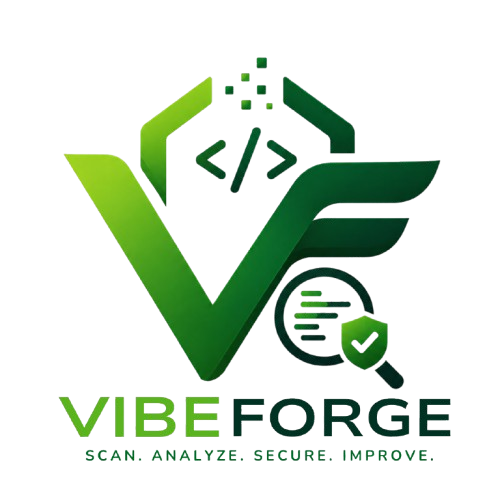

<div align="center">

<picture>
  <source media="(prefers-color-scheme: dark)" srcset="./assets/logo-dark.svg">
  <source media="(prefers-color-scheme: light)" srcset="./assets/logo-light.svg">
  
</picture>

<svg xmlns="http://www.w3.org/2000/svg" width="480" height="60" viewBox="0 0 480 60">
  <defs>
    <linearGradient id="grad" x1="0%" y1="0%" x2="100%" y2="0%">
      <stop offset="0%" style="stop-color:#7c3aed"/>
      <stop offset="100%" style="stop-color:#06b6d4"/>
    </linearGradient>
  </defs>
  <rect width="480" height="60" rx="8" fill="#0f0f11"/>
  <text x="50%" y="38" font-family="monospace" font-size="26" font-weight="bold"
        fill="url(#grad)" text-anchor="middle" letter-spacing="3">
    VibeForge
    <animate attributeName="opacity" values="1;0.7;1" dur="3s" repeatCount="indefinite"/>
  </text>
</svg>

### Your codebase has opinions. VibeForge reads them.

[](https://www.npmjs.com/package/vibeforge)
[](./LICENSE)
[](https://github.com/vibrforge/neuronexus/stargazers)
[](https://vercel.com)

</div>

---

## What it does

- Scans a codebase for security vulnerabilities, AI-generated slop, code smells, and performance issues - locally via CLI or in-browser via Monaco editor
- Grades output across five axes (A-F) and produces a single composite score you can drop into CI
- Generates HTML or JSON reports with `--report`, and optionally auto-fixes flagged patterns with `--fix`
- Accepts a GitHub URL or raw code paste in the web UI and annotates it with inline decorations and fix suggestions

---

## Demo


> Replace `./assets/demo.gif` with a screen recording of a scan run.

---

## Quick Start

```bash
# No install required
npx vibeforge scan ./src

# With a full HTML report
npx vibeforge scan ./src --report html

# Auto-fix what can be fixed
npx vibeforge scan ./src --fix
```

---

## Scoring Breakdown

| Axis | What it checks | Weight |
|------|---------------|--------|
| Security | Hardcoded secrets, injection vectors, insecure deps, exposed env vars | 30% |
| AI Slop | Copy-paste GPT patterns, dead logic branches, hallucinated variable names | 25% |
| Code Quality | Complexity, duplication, naming, error handling consistency | 20% |
| Performance | N+1 queries, blocking I/O, unoptimized loops, large bundle contributors | 15% |
| Structure | File organization, circular deps, module coupling, naming conventions | 10% |

Grades: **A** (90-100) · **B** (75-89) · **C** (60-74) · **D** (45-59) · **F** (<45)

---

## Pricing

| | Free | Pro |
|---|---|---|
| Web scans | 3 / day | Unlimited |
| CLI access (`npx vibeforge`) | - | Included |
| HTML / JSON reports | - | Included |
| `--fix` flag | - | Included |
| Auth | Google / GitHub via Supabase | Google / GitHub via Supabase |
| Price | Free | ₹499 / month |

---

## Tech Stack

<div align="left">

[](https://nextjs.org)
[](https://expressjs.com)
[](https://www.typescriptlang.org)
[](https://tailwindcss.com)
[](https://ui.shadcn.com)
[](https://microsoft.github.io/monaco-editor)
[](https://supabase.com)
[](https://www.anthropic.com)
[](https://recharts.org)
[](https://razorpay.com)
[](https://vercel.com)
[](https://www.npmjs.com/package/vibeforge)

</div>

---

## Project Structure

```
NeuroNexus/
├── client/                  # Next.js 14 App Router (web UI)
│   ├── app/
│   │   ├── dashboard/       # Authenticated user dashboard
│   │   ├── editor/          # Monaco editor + inline review
│   │   ├── scanner/         # GitHub URL scanner
│   │   ├── billing/         # Plan management + Razorpay
│   │   └── login/           # Supabase OAuth flow
│   ├── components/          # Shared UI components
│   └── lib/                 # Auth helpers, Supabase clients
│
├── packages/
│   └── cli/                 # npx vibeforge CLI (Node.js)
│       └── src/
│           └── index.ts     # Entry point
│
└── apps/                    # Additional services (expand as needed)
```

---

## Contributing

Issues and PRs are welcome. Read [CONTRIBUTING.md](./CONTRIBUTING.md) before opening one.
Please run `npx vibeforge scan ./src` on your changes before submitting.

---

## License

MIT - see [LICENSE](./LICENSE).
